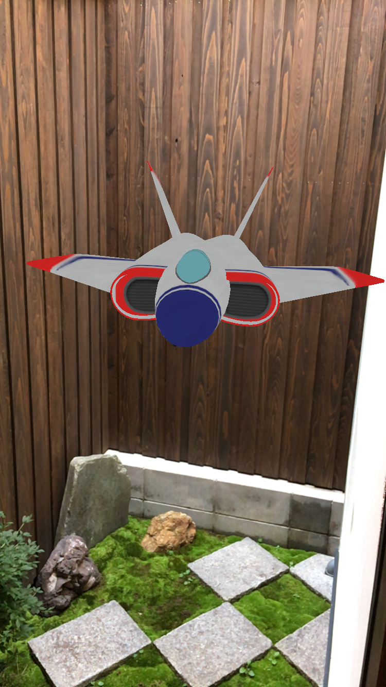
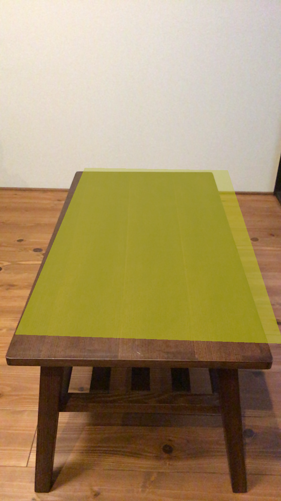
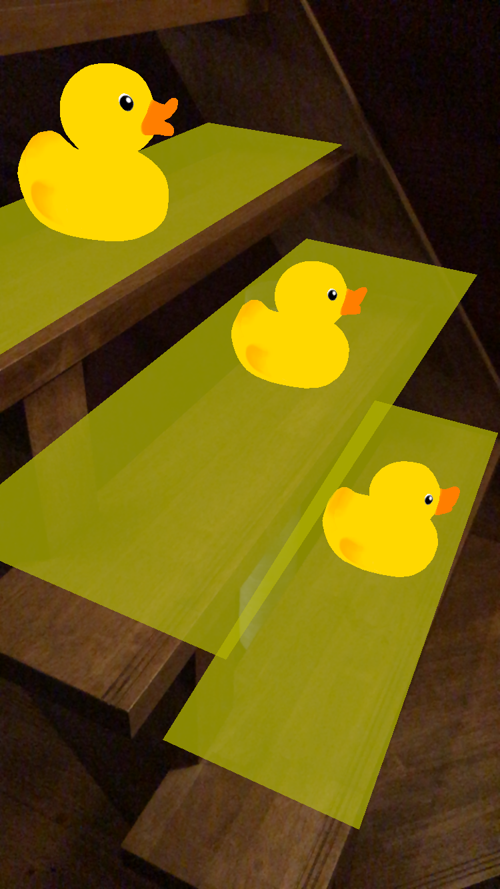
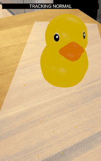
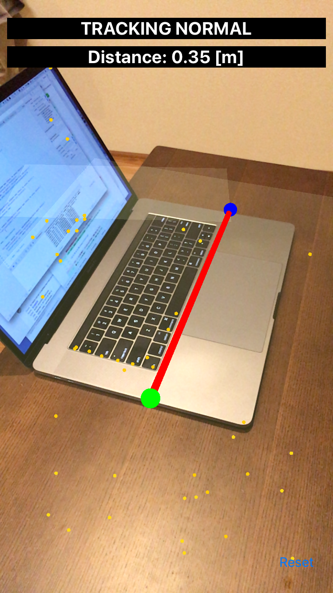
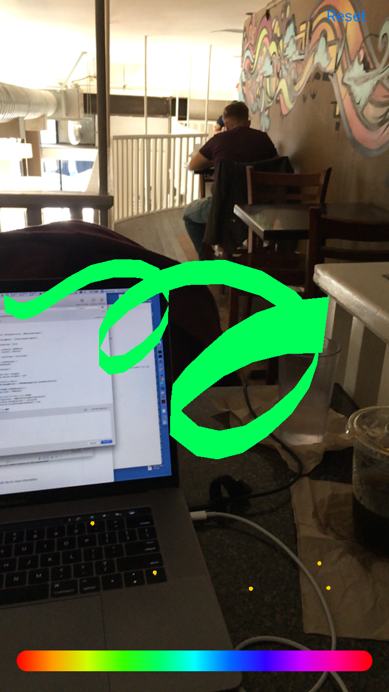
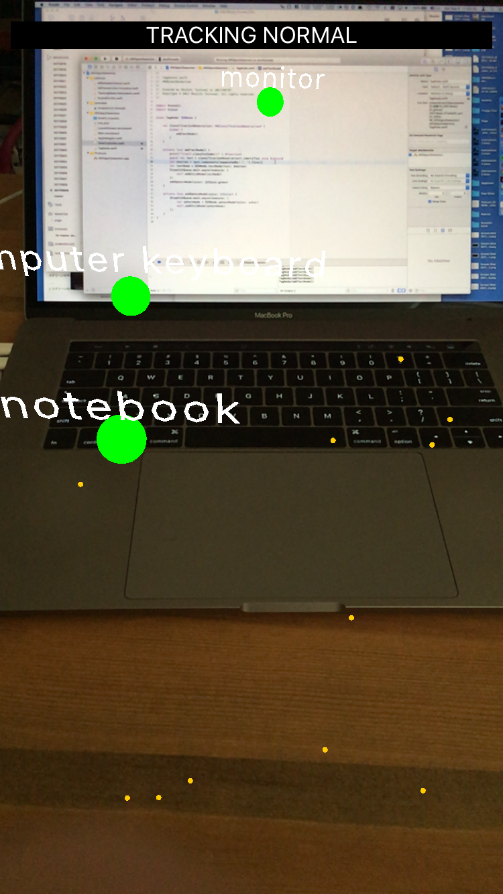
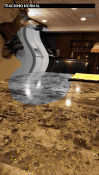
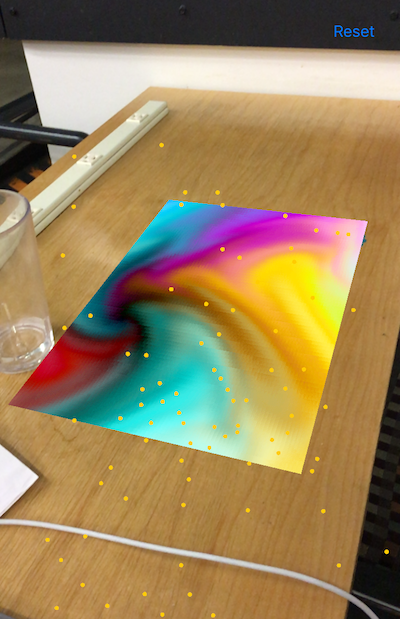

# ARKit-Sampler

ARKit-Sampler is a collection of ARKit samples.

## How to build

1. Download `Inceptionv3.mlmodel` from [here](https://developer.apple.com/machine-learning/
), then put it into the `mlmodels` folder.
2. Open `ARKit-Sampler.xcworkspace` with Xcode 9 and build it.

It can **NOT** run on **Simulator**. (Because it uses Metal.)

## Contents

### 3 lines AR

A simple AR with 3 lines code.

### Plane Detection

A sample to show how simply ARKit can detect planes.

### Virtual Object

A sample to show how to add a virtual object to a detected plane.

### AR Interaction

Interactions with virtual objects or detected plane anchors.

### AR Measure

Measuring lengths in the real space.

### AR Drawing

Drawing in the real space.

### Core ML + ARKit",

AR Tagging to detected objects using Core ML.

### Metal + ARKit

Rendering with Metal.

### Metal + ARKit (SCNProgram)

Rendering the virtual node's material with Metal shader using `SCNProgram`.

### Simple Face Tracking

Simplest Face-Based AR implementation.

### Coming soon...

- Audio + ARKit
- Core Location / MapKit + ARKit
- etc...

## Author

**Shuichi Tsutsumi**

iOS programmer from Japan.

- PAST WORKS:  [My Profile Summary](https://medium.com/@shu223/my-profile-summary-f14bfc1e7099#.vdh0i7clr)
- PROFILES: [LinkedIn](https://www.linkedin.com/in/shuichi-tsutsumi-525b755b/)
- BLOGS: [English](https://medium.com/@shu223/) / [Japanese](http://d.hatena.ne.jp/shu223/)
- CONTACTS: [Twitter](https://twitter.com/shu223) / [Facebook](https://www.facebook.com/shuichi.tsutsumi)

## Special Thanks

The icon is designed by [Okazu](https://www.facebook.com/pashimo)
